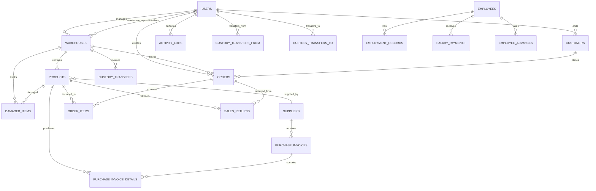

# Design Document

## Overview

نظام إدارة المخازن ونقاط البيع (Stock Manager POS System) هو نظام متكامل يهدف إلى إدارة عمليات البيع والمخزون والعملاء والموردين في بيئة تجارية. يعمل النظام كتطبيق Desktop باستخدام Tauri وWeb Application على الشبكة المحلية (LAN)، مع دعم واجهة موبايل منفصلة.

### النطاق (Scope)

يغطي هذا التصميم:

1. **System Architecture**: البنية المعمارية الشاملة للنظام
2. **Database Design**: تصميم قاعدة البيانات الكامل (22 جدول)
3. **API Design**: جميع الـ REST API endpoints
4. **Frontend Architecture**: هيكل Frontend مع 20 صفحة و26 نافذة حوار
5. **UI/UX Design System**: نظام التصميم والألوان والمكونات
6. **Security Design**: آليات الأمان والمصادقة
7. **Performance Optimization**: استراتيجيات تحسين الأداء

### Technology Stack

**Frontend:**
- React 18 + TypeScript
- Vite (Build Tool)
- Tailwind CSS + shadcn/ui (Radix UI)
- React Router DOM v6
- TanStack Query (React Query)
- Axios (HTTP Client)
- Lucide React (Icons)
- JsBarcode (Barcode Generation)

**Backend:**
- Laravel 11 (PHP)
- Laravel Sanctum (Token Authentication)
- MySQL 9.4
- Eloquent ORM

**Desktop Wrapper:**
- Tauri (Rust-based)

**Mobile:**
- React-based Mobile Interface
- Native Camera Integration for Barcode Scanning


---

## Architecture

### System Architecture Overview

النظام يتبع معمارية Client-Server ثلاثية الطبقات (Three-Tier Architecture):

```
┌─────────────────────────────────────────────────────────────┐
│                    Presentation Layer                        │
│  ┌──────────────┐  ┌──────────────┐  ┌──────────────┐      │
│  │   Desktop    │  │     Web      │  │    Mobile    │      │
│  │   (Tauri)    │  │   Browser    │  │  Interface   │      │
│  │              │  │              │  │              │      │
│  │  React App   │  │  React App   │  │  React App   │      │
│  └──────────────┘  └──────────────┘  └──────────────┘      │
└─────────────────────────────────────────────────────────────┘
                            │
                            │ HTTPS/REST API
                            │ (JSON over HTTP)
                            ▼
┌─────────────────────────────────────────────────────────────┐
│                     Application Layer                        │
│  ┌──────────────────────────────────────────────────────┐   │
│  │            Laravel 11 Backend API                    │   │
│  │                                                      │   │
│  │  ┌──────────┐  ┌───────────┐  ┌─────────────┐     │   │
│  │  │Controllers│  │ Services  │  │ Middleware  │     │   │
│  │  │  (REST)  │  │  (Logic)  │  │   (Auth)    │     │   │
│  │  └──────────┘  └───────────┘  └─────────────┘     │   │
│  │                                                      │   │
│  │  ┌──────────┐  ┌───────────┐  ┌─────────────┐     │   │
│  │  │  Models  │  │Validators │  │   Events    │     │   │
│  │  │(Eloquent)│  │  (Rules)  │  │ (Logging)   │     │   │
│  │  └──────────┘  └───────────┘  └─────────────┘     │   │
│  └──────────────────────────────────────────────────┘   │
└─────────────────────────────────────────────────────────────┘
                            │
                            │ SQL Queries
                            │ (Eloquent ORM)
                            ▼
┌─────────────────────────────────────────────────────────────┐
│                       Data Layer                             │
│  ┌──────────────────────────────────────────────────────┐   │
│  │               MySQL Database                         │   │
│  │                                                      │   │
│  │   22 Tables + Relationships + Constraints           │   │
│  │   Foreign Keys + Indexes + Soft Deletes             │   │
│  └──────────────────────────────────────────────────┘   │
└─────────────────────────────────────────────────────────────┘
```

### Network Architecture

النظام يدعم وضعين:

**1. Master Mode (الجهاز الرئيسي):**
```
┌────────────────────────────────────────┐
│         Master Server Device           │
│                                        │
│  ┌──────────────────────────────────┐ │
│  │   Laravel Backend (Port 8002)    │ │
│  │   + MySQL Database               │ │
│  └──────────────────────────────────┘ │
│              │                         │
│              │ Broadcasts IP:Port      │
│              ▼                         │
│    Network: 192.168.1.100:8002        │
└────────────────────────────────────────┘
              │
              │ LAN Connection
              ▼
┌─────────────────────────────────────────┐
│       Employee Devices (Clients)        │
│                                         │
│  ┌─────────┐  ┌─────────┐  ┌─────────┐│
│  │ Client 1│  │ Client 2│  │ Client 3││
│  │ (POS)   │  │ (Office)│  │ (Mobile)││
│  └─────────┘  └─────────┘  └─────────┘│
│                                         │
│  Configure: api_base_url =              │
│            http://192.168.1.100:8002    │
└─────────────────────────────────────────┘
```

**2. Employee Mode (أجهزة العملاء):**
- تتصل بخادم Master عبر IP:Port
- تخزن الإعدادات في localStorage
- تدعم Test Connection للتحقق من الاتصال

### Component Architecture

```
┌─────────────────────────────────────────────────────────────┐
│                     Frontend Structure                       │
│                                                              │
│  ┌─────────────────────────────────────────────────────┐   │
│  │                  Application Core                   │   │
│  │                                                     │   │
│  │  ┌──────────────┐  ┌──────────────┐  ┌──────────┐│   │
│  │  │UserContext   │  │AuthProvider  │  │QueryClient││   │
│  │  │(Auth State)  │  │(Sanctum)     │  │(Cache)   ││   │
│  │  └──────────────┘  └──────────────┘  └──────────┘│   │
│  └─────────────────────────────────────────────────────┘   │
│                           │                                 │
│  ┌────────────────────────┴──────────────────────────┐     │
│  │                  Routing Layer                    │     │
│  │                                                   │     │
│  │  React Router DOM v6                             │     │
│  │  - Protected Routes (Role-based)                 │     │
│  │  - Public Routes (Login)                         │     │
│  │  - Mobile Routes (/m/*)                          │     │
│  └───────────────────────────────────────────────────┘     │
│                           │                                 │
│  ┌────────────────────────┴──────────────────────────┐     │
│  │                  Page Components                  │     │
│  │                                                   │     │
│  │  20 Pages: Dashboard, POS, Products, etc.        │     │
│  └───────────────────────────────────────────────────┘     │
│                           │                                 │
│  ┌────────────────────────┴──────────────────────────┐     │
│  │              Feature Components                   │     │
│  │                                                   │     │
│  │  26 Dialogs + Specialized Components             │     │
│  └───────────────────────────────────────────────────┘     │
│                           │                                 │
│  ┌────────────────────────┴──────────────────────────┐     │
│  │                UI Components                      │     │
│  │                                                   │     │
│  │  shadcn/ui + Custom Components                   │     │
│  │  (Button, Dialog, Card, etc.)                    │     │
│  └───────────────────────────────────────────────────┘     │
└─────────────────────────────────────────────────────────────┘
```

### Data Flow Architecture

```
┌────────────────────────────────────────────────────────────┐
│                      User Action                           │
│                   (Button Click / Form Submit)             │
└────────────────────────┬───────────────────────────────────┘
                         ▼
┌────────────────────────────────────────────────────────────┐
│                   Component Event Handler                   │
│                  (onClick / onSubmit)                      │
└────────────────────────┬───────────────────────────────────┘
                         ▼
┌────────────────────────────────────────────────────────────┐
│              TanStack Query Mutation/Query                 │
│        (useMutation / useQuery with API function)          │
└────────────────────────┬───────────────────────────────────┘
                         ▼
┌────────────────────────────────────────────────────────────┐
│                    Axios HTTP Request                      │
│         (GET/POST/PUT/DELETE to Laravel API)              │
│    Headers: Authorization: Bearer {token}                 │
└────────────────────────┬───────────────────────────────────┘
                         ▼
┌────────────────────────────────────────────────────────────┐
│               Laravel API Endpoint                         │
│    1. Middleware: Sanctum Auth + Role Check               │
│    2. Validation: Request Validation Rules                │
│    3. Controller: Business Logic                          │
│    4. Model: Eloquent Database Operations                 │
│    5. Response: JSON with Data/Error                      │
└────────────────────────┬───────────────────────────────────┘
                         ▼
┌────────────────────────────────────────────────────────────┐
│                    Database (MySQL)                        │
│              Execute Query + Return Results                │
└────────────────────────┬───────────────────────────────────┘
                         ▼
┌────────────────────────────────────────────────────────────┐
│                  Response Back to Frontend                 │
│      TanStack Query Updates Cache + Component State       │
└────────────────────────┬───────────────────────────────────┘
                         ▼
┌────────────────────────────────────────────────────────────┐
│                      UI Update                             │
│           React Re-renders with New Data                   │
│        + Toast Notification (Success/Error)                │
└────────────────────────────────────────────────────────────┘
```

### Authentication Flow

```
┌──────────────────────────────────────────────────────────┐
│              User Enters Credentials                      │
│           (email + password on /login)                   │
└──────────────────────┬───────────────────────────────────┘
                       ▼
┌──────────────────────────────────────────────────────────┐
│         POST /api/auth/login                             │
│         { email, password }                              │
└──────────────────────┬───────────────────────────────────┘
                       ▼
┌──────────────────────────────────────────────────────────┐
│          Laravel Sanctum Authentication                   │
│   1. Validate credentials                                │
│   2. Create access token                                 │
│   3. Return: { token, user: {id, name, role, ...} }     │
└──────────────────────┬───────────────────────────────────┘
                       ▼
┌──────────────────────────────────────────────────────────┐
│       Frontend Stores Token in localStorage              │
│       localStorage.setItem('token', token)               │
│       UserContext updates: setUser(user)                 │
└──────────────────────┬───────────────────────────────────┘
                       ▼
┌──────────────────────────────────────────────────────────┐
│           Redirect to Dashboard (/)                      │
│       All subsequent requests include:                   │
│       Authorization: Bearer {token}                      │
└──────────────────────────────────────────────────────────┘
                       │
        ┌──────────────┴──────────────┐
        ▼                             ▼
┌───────────────┐           ┌──────────────────┐
│  API Request  │           │  Token Expires   │
│  (Authorized) │           │  or User Logout  │
└───────────────┘           └─────────┬────────┘
                                     ▼
                          ┌────────────────────┐
                          │ Clear localStorage │
                          │ Clear UserContext  │
                          │ Redirect to /login │
                          └────────────────────┘
```

### Role-Based Access Control (RBAC)

```
┌──────────────────────────────────────────────────────────┐
│                    User Roles                            │
│                                                          │
│  ┌────────────┐   ┌────────────┐   ┌────────────┐     │
│  │   مدير     │   │   محاسب    │   │   مندوب    │     │
│  │  (Manager) │   │(Accountant)│   │   (Sales)  │     │
│  └────────────┘   └────────────┘   └────────────┘     │
│        │                 │                 │           │
│        │                 │                 │           │
│   16 Pages         13 Pages          5 Pages          │
│   Full Access      Limited           POS Focus         │
└──────────────────────────────────────────────────────────┘

Role Permissions Matrix:

┌──────────────────────┬────────┬─────────┬─────────┐
│      Page/Feature    │  مدير  │ محاسب   │  مندوب  │
├──────────────────────┼────────┼─────────┼─────────┤
│ Dashboard            │   ✅   │   ✅    │   ❌    │
│ POS                  │   ✅   │   ❌    │   ✅    │
│ Products             │   ✅   │   ✅    │   ❌    │
│ Customers            │   ✅   │   ✅    │   ✅    │
│ Returns              │   ✅   │   ✅    │   ✅    │
│ Damaged Items        │   ✅   │   ✅    │   ✅*   │
│ Warehouses           │   ✅   │   ✅    │   ❌    │
│ Purchase Invoices    │   ✅   │   ✅    │   ❌    │
│ Suppliers            │   ✅   │   ✅    │   ❌    │
│ Expenses             │   ✅   │   ✅    │   ❌    │
│ Capital              │   ✅   │   ✅    │   ❌    │
│ Reports              │   ✅   │   ✅    │   ❌    │
│ Activity Logs        │   ✅   │   ✅    │   ❌    │
│ Employees            │   ✅   │   ✅    │   ❌    │
│ Users                │   ✅   │   ❌    │   ❌    │
│ Settings             │   ✅   │   ✅    │   ❌    │
└──────────────────────┴────────┴─────────┴─────────┘

* مندوب can view damaged items but only مدير can approve/reject
```


---

## Components and Interfaces

### Database Design

#### Entity Relationship Diagram (ERD)



#### Table Schemas


**1. users**
```sql
CREATE TABLE users (
    id BIGINT UNSIGNED AUTO_INCREMENT PRIMARY KEY,
    name VARCHAR(255) NOT NULL,
    email VARCHAR(255) UNIQUE NOT NULL,
    password VARCHAR(255) NOT NULL,
    phone VARCHAR(20),
    role ENUM('مدير', 'محاسب', 'مندوب') NOT NULL,
    is_active TINYINT(1) DEFAULT 1,
    warehouse_id BIGINT UNSIGNED NULL,
    email_verified_at TIMESTAMP NULL,
    remember_token VARCHAR(100) NULL,
    last_login_at TIMESTAMP NULL,
    created_at TIMESTAMP DEFAULT CURRENT_TIMESTAMP,
    updated_at TIMESTAMP DEFAULT CURRENT_TIMESTAMP ON UPDATE CURRENT_TIMESTAMP,
    
    FOREIGN KEY (warehouse_id) REFERENCES warehouses(id) ON DELETE SET NULL,
    INDEX idx_email (email),
    INDEX idx_role (role),
    INDEX idx_is_active (is_active)
) ENGINE=InnoDB DEFAULT CHARSET=utf8mb4 COLLATE=utf8mb4_unicode_ci;
```

**2. warehouses**
```sql
CREATE TABLE warehouses (
    id BIGINT UNSIGNED AUTO_INCREMENT PRIMARY KEY,
    name VARCHAR(255) NOT NULL,
    type ENUM('رئيسي', 'فرعي') DEFAULT 'فرعي',
    address TEXT NULL,
    custody_status ENUM('permanent', 'temporary') DEFAULT 'permanent',
    created_at TIMESTAMP DEFAULT CURRENT_TIMESTAMP,
    updated_at TIMESTAMP DEFAULT CURRENT_TIMESTAMP ON UPDATE CURRENT_TIMESTAMP,
    
    INDEX idx_type (type),
    INDEX idx_name (name)
) ENGINE=InnoDB DEFAULT CHARSET=utf8mb4 COLLATE=utf8mb4_unicode_ci;
```


**3. warehouse_representatives** (Many-to-Many Pivot Table)
```sql
CREATE TABLE warehouse_representatives (
    warehouse_id BIGINT UNSIGNED NOT NULL,
    user_id BIGINT UNSIGNED NOT NULL,
    assigned_at TIMESTAMP DEFAULT CURRENT_TIMESTAMP,
    
    PRIMARY KEY (warehouse_id, user_id),
    FOREIGN KEY (warehouse_id) REFERENCES warehouses(id) ON DELETE CASCADE,
    FOREIGN KEY (user_id) REFERENCES users(id) ON DELETE CASCADE
) ENGINE=InnoDB DEFAULT CHARSET=utf8mb4 COLLATE=utf8mb4_unicode_ci;
```

**4. categories**
```sql
CREATE TABLE categories (
    id BIGINT UNSIGNED AUTO_INCREMENT PRIMARY KEY,
    name VARCHAR(255) NOT NULL UNIQUE,
    description TEXT NULL,
    created_at TIMESTAMP DEFAULT CURRENT_TIMESTAMP,
    updated_at TIMESTAMP DEFAULT CURRENT_TIMESTAMP ON UPDATE CURRENT_TIMESTAMP
) ENGINE=InnoDB DEFAULT CHARSET=utf8mb4 COLLATE=utf8mb4_unicode_ci;
```

**5. suppliers**
```sql
CREATE TABLE suppliers (
    id BIGINT UNSIGNED AUTO_INCREMENT PRIMARY KEY,
    name VARCHAR(255) NOT NULL,
    phone VARCHAR(20) NOT NULL,
    email VARCHAR(255) NULL,
    address TEXT NULL,
    balance DECIMAL(12,2) DEFAULT 0.00 COMMENT 'موجب = علينا، سالب = لنا',
    created_at TIMESTAMP DEFAULT CURRENT_TIMESTAMP,
    updated_at TIMESTAMP DEFAULT CURRENT_TIMESTAMP ON UPDATE CURRENT_TIMESTAMP,
    
    INDEX idx_name (name),
    INDEX idx_phone (phone)
) ENGINE=InnoDB DEFAULT CHARSET=utf8mb4 COLLATE=utf8mb4_unicode_ci;
```


**6. products**
```sql
CREATE TABLE products (
    id BIGINT UNSIGNED AUTO_INCREMENT PRIMARY KEY,
    name VARCHAR(255) NOT NULL,
    barcode VARCHAR(255) UNIQUE NOT NULL,
    price DECIMAL(10,2) NOT NULL,
    cost_price DECIMAL(10,2) DEFAULT 0.00,
    stock INT DEFAULT 0,
    warehouse_id BIGINT UNSIGNED NOT NULL,
    supplier_id BIGINT UNSIGNED NULL,
    category VARCHAR(255) NULL,
    description TEXT NULL,
    image_path VARCHAR(255) NULL,
    reorder_level INT DEFAULT 10,
    production_date DATE NULL,
    expiry_date DATE NULL,
    created_at TIMESTAMP DEFAULT CURRENT_TIMESTAMP,
    updated_at TIMESTAMP DEFAULT CURRENT_TIMESTAMP ON UPDATE CURRENT_TIMESTAMP,
    
    FOREIGN KEY (warehouse_id) REFERENCES warehouses(id) ON DELETE CASCADE,
    FOREIGN KEY (supplier_id) REFERENCES suppliers(id) ON DELETE SET NULL,
    INDEX idx_barcode (barcode),
    INDEX idx_name (name),
    INDEX idx_category (category),
    INDEX idx_stock (stock),
    INDEX idx_warehouse (warehouse_id)
) ENGINE=InnoDB DEFAULT CHARSET=utf8mb4 COLLATE=utf8mb4_unicode_ci;
```

**7. customers**
```sql
CREATE TABLE customers (
    id BIGINT UNSIGNED AUTO_INCREMENT PRIMARY KEY,
    name VARCHAR(255) NOT NULL,
    phone VARCHAR(20) NOT NULL,
    address TEXT NULL,
    balance DECIMAL(12,2) DEFAULT 0.00,
    status ENUM('pending', 'approved') DEFAULT 'approved',
    added_by BIGINT UNSIGNED NOT NULL,
    is_vip TINYINT(1) DEFAULT 0,
    vip_color VARCHAR(7) NULL,
    representative_id BIGINT UNSIGNED NULL,
    last_purchase_date TIMESTAMP NULL,
    total_purchases DECIMAL(12,2) DEFAULT 0.00,
    created_at TIMESTAMP DEFAULT CURRENT_TIMESTAMP,
    updated_at TIMESTAMP DEFAULT CURRENT_TIMESTAMP ON UPDATE CURRENT_TIMESTAMP,
    deleted_at TIMESTAMP NULL,
    
    FOREIGN KEY (added_by) REFERENCES users(id) ON DELETE RESTRICT,
    FOREIGN KEY (representative_id) REFERENCES users(id) ON DELETE SET NULL,
    INDEX idx_name (name),
    INDEX idx_phone (phone),
    INDEX idx_status (status),
    INDEX idx_is_vip (is_vip),
    INDEX idx_deleted_at (deleted_at)
) ENGINE=InnoDB DEFAULT CHARSET=utf8mb4 COLLATE=utf8mb4_unicode_ci;
```


**8. orders** (Sales Invoices)
```sql
CREATE TABLE orders (
    id BIGINT UNSIGNED AUTO_INCREMENT PRIMARY KEY,
    order_number VARCHAR(50) UNIQUE NOT NULL,
    user_id BIGINT UNSIGNED NOT NULL,
    customer_id BIGINT UNSIGNED NULL,
    warehouse_id BIGINT UNSIGNED NOT NULL,
    subtotal DECIMAL(12,2) NOT NULL,
    tax_amount DECIMAL(12,2) DEFAULT 0.00,
    total_amount DECIMAL(12,2) NOT NULL,
    amount_paid DECIMAL(12,2) DEFAULT 0.00,
    payment_method ENUM('cash', 'card', 'credit') DEFAULT 'cash',
    status ENUM('completed', 'cancelled', 'refunded') DEFAULT 'completed',
    notes TEXT NULL,
    created_at TIMESTAMP DEFAULT CURRENT_TIMESTAMP,
    updated_at TIMESTAMP DEFAULT CURRENT_TIMESTAMP ON UPDATE CURRENT_TIMESTAMP,
    
    FOREIGN KEY (user_id) REFERENCES users(id) ON DELETE RESTRICT,
    FOREIGN KEY (customer_id) REFERENCES customers(id) ON DELETE SET NULL,
    FOREIGN KEY (warehouse_id) REFERENCES warehouses(id) ON DELETE RESTRICT,
    INDEX idx_order_number (order_number),
    INDEX idx_customer (customer_id),
    INDEX idx_created_at (created_at),
    INDEX idx_status (status)
) ENGINE=InnoDB DEFAULT CHARSET=utf8mb4 COLLATE=utf8mb4_unicode_ci;
```

**9. order_items**
```sql
CREATE TABLE order_items (
    id BIGINT UNSIGNED AUTO_INCREMENT PRIMARY KEY,
    order_id BIGINT UNSIGNED NOT NULL,
    product_id BIGINT UNSIGNED NOT NULL,
    quantity INT NOT NULL,
    unit_price DECIMAL(12,2) NOT NULL,
    total_price DECIMAL(12,2) NOT NULL,
    created_at TIMESTAMP DEFAULT CURRENT_TIMESTAMP,
    updated_at TIMESTAMP DEFAULT CURRENT_TIMESTAMP ON UPDATE CURRENT_TIMESTAMP,
    
    FOREIGN KEY (order_id) REFERENCES orders(id) ON DELETE CASCADE,
    FOREIGN KEY (product_id) REFERENCES products(id) ON DELETE RESTRICT,
    INDEX idx_order (order_id),
    INDEX idx_product (product_id)
) ENGINE=InnoDB DEFAULT CHARSET=utf8mb4 COLLATE=utf8mb4_unicode_ci;
```


**10. purchase_invoices**
```sql
CREATE TABLE purchase_invoices (
    id BIGINT UNSIGNED AUTO_INCREMENT PRIMARY KEY,
    invoice_number VARCHAR(50) UNIQUE NOT NULL,
    supplier_id BIGINT UNSIGNED NOT NULL,
    invoice_date DATE NOT NULL,
    total_amount DECIMAL(12,2) NOT NULL,
    amount_paid DECIMAL(12,2) DEFAULT 0.00,
    remaining_amount DECIMAL(12,2) NOT NULL,
    payment_status ENUM('paid', 'partial', 'unpaid') DEFAULT 'unpaid',
    notes TEXT NULL,
    created_at TIMESTAMP DEFAULT CURRENT_TIMESTAMP,
    updated_at TIMESTAMP DEFAULT CURRENT_TIMESTAMP ON UPDATE CURRENT_TIMESTAMP,
    
    FOREIGN KEY (supplier_id) REFERENCES suppliers(id) ON DELETE RESTRICT,
    INDEX idx_invoice_number (invoice_number),
    INDEX idx_supplier (supplier_id),
    INDEX idx_payment_status (payment_status),
    INDEX idx_invoice_date (invoice_date)
) ENGINE=InnoDB DEFAULT CHARSET=utf8mb4 COLLATE=utf8mb4_unicode_ci;
```

**11. purchase_invoice_details**
```sql
CREATE TABLE purchase_invoice_details (
    id BIGINT UNSIGNED AUTO_INCREMENT PRIMARY KEY,
    purchase_invoice_id BIGINT UNSIGNED NOT NULL,
    product_id BIGINT UNSIGNED NOT NULL,
    quantity INT NOT NULL,
    unit_price DECIMAL(12,2) NOT NULL,
    total_price DECIMAL(12,2) NOT NULL,
    created_at TIMESTAMP DEFAULT CURRENT_TIMESTAMP,
    updated_at TIMESTAMP DEFAULT CURRENT_TIMESTAMP ON UPDATE CURRENT_TIMESTAMP,
    
    FOREIGN KEY (purchase_invoice_id) REFERENCES purchase_invoices(id) ON DELETE CASCADE,
    FOREIGN KEY (product_id) REFERENCES products(id) ON DELETE RESTRICT,
    INDEX idx_invoice (purchase_invoice_id),
    INDEX idx_product (product_id)
) ENGINE=InnoDB DEFAULT CHARSET=utf8mb4 COLLATE=utf8mb4_unicode_ci;
```


**12. sales_returns**
```sql
CREATE TABLE sales_returns (
    id BIGINT UNSIGNED AUTO_INCREMENT PRIMARY KEY,
    order_id BIGINT UNSIGNED NULL,
    product_id BIGINT UNSIGNED NULL,
    customer_id BIGINT UNSIGNED NULL,
    quantity INT NOT NULL,
    refund_amount DECIMAL(12,2) NOT NULL,
    refund_method ENUM('cash', 'credit') NOT NULL,
    reason TEXT NOT NULL,
    return_type ENUM('single', 'full_invoice') NOT NULL,
    processed_by BIGINT UNSIGNED NOT NULL,
    created_at TIMESTAMP DEFAULT CURRENT_TIMESTAMP,
    updated_at TIMESTAMP DEFAULT CURRENT_TIMESTAMP ON UPDATE CURRENT_TIMESTAMP,
    
    FOREIGN KEY (order_id) REFERENCES orders(id) ON DELETE SET NULL,
    FOREIGN KEY (product_id) REFERENCES products(id) ON DELETE SET NULL,
    FOREIGN KEY (customer_id) REFERENCES customers(id) ON DELETE SET NULL,
    FOREIGN KEY (processed_by) REFERENCES users(id) ON DELETE RESTRICT,
    INDEX idx_order (order_id),
    INDEX idx_product (product_id),
    INDEX idx_return_type (return_type),
    INDEX idx_created_at (created_at)
) ENGINE=InnoDB DEFAULT CHARSET=utf8mb4 COLLATE=utf8mb4_unicode_ci;
```

**13. damaged_items**
```sql
CREATE TABLE damaged_items (
    id BIGINT UNSIGNED AUTO_INCREMENT PRIMARY KEY,
    product_id BIGINT UNSIGNED NOT NULL,
    warehouse_id BIGINT UNSIGNED NOT NULL,
    quantity INT NOT NULL,
    loss_amount DECIMAL(12,2) NOT NULL,
    reason TEXT NOT NULL,
    status ENUM('pending', 'approved', 'rejected') DEFAULT 'pending',
    reported_by BIGINT UNSIGNED NOT NULL,
    approved_by BIGINT UNSIGNED NULL,
    approved_at TIMESTAMP NULL,
    created_at TIMESTAMP DEFAULT CURRENT_TIMESTAMP,
    updated_at TIMESTAMP DEFAULT CURRENT_TIMESTAMP ON UPDATE CURRENT_TIMESTAMP,
    
    FOREIGN KEY (product_id) REFERENCES products(id) ON DELETE RESTRICT,
    FOREIGN KEY (warehouse_id) REFERENCES warehouses(id) ON DELETE RESTRICT,
    FOREIGN KEY (reported_by) REFERENCES users(id) ON DELETE RESTRICT,
    FOREIGN KEY (approved_by) REFERENCES users(id) ON DELETE SET NULL,
    INDEX idx_product (product_id),
    INDEX idx_warehouse (warehouse_id),
    INDEX idx_status (status)
) ENGINE=InnoDB DEFAULT CHARSET=utf8mb4 COLLATE=utf8mb4_unicode_ci;
```


**14. custody_transfers**
```sql
CREATE TABLE custody_transfers (
    id BIGINT UNSIGNED AUTO_INCREMENT PRIMARY KEY,
    warehouse_id BIGINT UNSIGNED NOT NULL,
    from_user_id BIGINT UNSIGNED NOT NULL,
    to_user_id BIGINT UNSIGNED NOT NULL,
    type ENUM('permanent', 'temporary') NOT NULL,
    status ENUM('pending', 'accepted', 'rejected', 'completed') DEFAULT 'pending',
    return_date DATE NULL,
    notes TEXT NULL,
    created_at TIMESTAMP DEFAULT CURRENT_TIMESTAMP,
    updated_at TIMESTAMP DEFAULT CURRENT_TIMESTAMP ON UPDATE CURRENT_TIMESTAMP,
    
    FOREIGN KEY (warehouse_id) REFERENCES warehouses(id) ON DELETE CASCADE,
    FOREIGN KEY (from_user_id) REFERENCES users(id) ON DELETE RESTRICT,
    FOREIGN KEY (to_user_id) REFERENCES users(id) ON DELETE RESTRICT,
    INDEX idx_warehouse (warehouse_id),
    INDEX idx_status (status),
    INDEX idx_type (type)
) ENGINE=InnoDB DEFAULT CHARSET=utf8mb4 COLLATE=utf8mb4_unicode_ci;
```

**15. employees**
```sql
CREATE TABLE employees (
    id BIGINT UNSIGNED AUTO_INCREMENT PRIMARY KEY,
    name VARCHAR(255) NOT NULL,
    position VARCHAR(255) NOT NULL,
    phone VARCHAR(20) NOT NULL,
    base_salary DECIMAL(10,2) NOT NULL,
    hire_date DATE NOT NULL,
    status ENUM('active', 'archived') DEFAULT 'active',
    created_at TIMESTAMP DEFAULT CURRENT_TIMESTAMP,
    updated_at TIMESTAMP DEFAULT CURRENT_TIMESTAMP ON UPDATE CURRENT_TIMESTAMP,
    
    INDEX idx_name (name),
    INDEX idx_position (position),
    INDEX idx_status (status)
) ENGINE=InnoDB DEFAULT CHARSET=utf8mb4 COLLATE=utf8mb4_unicode_ci;
```


**16. employment_records**
```sql
CREATE TABLE employment_records (
    id BIGINT UNSIGNED AUTO_INCREMENT PRIMARY KEY,
    employee_id BIGINT UNSIGNED NOT NULL,
    salary DECIMAL(10,2) NOT NULL,
    start_date DATE NOT NULL,
    end_date DATE NULL,
    termination_reason TEXT NULL,
    created_at TIMESTAMP DEFAULT CURRENT_TIMESTAMP,
    updated_at TIMESTAMP DEFAULT CURRENT_TIMESTAMP ON UPDATE CURRENT_TIMESTAMP,
    
    FOREIGN KEY (employee_id) REFERENCES employees(id) ON DELETE CASCADE,
    INDEX idx_employee (employee_id),
    INDEX idx_dates (start_date, end_date)
) ENGINE=InnoDB DEFAULT CHARSET=utf8mb4 COLLATE=utf8mb4_unicode_ci;
```

**17. salary_payments**
```sql
CREATE TABLE salary_payments (
    id BIGINT UNSIGNED AUTO_INCREMENT PRIMARY KEY,
    employee_id BIGINT UNSIGNED NOT NULL,
    amount DECIMAL(10,2) NOT NULL,
    type ENUM('salary', 'bonus') NOT NULL,
    payment_date DATE NOT NULL,
    notes TEXT NULL,
    created_at TIMESTAMP DEFAULT CURRENT_TIMESTAMP,
    updated_at TIMESTAMP DEFAULT CURRENT_TIMESTAMP ON UPDATE CURRENT_TIMESTAMP,
    
    FOREIGN KEY (employee_id) REFERENCES employees(id) ON DELETE CASCADE,
    INDEX idx_employee (employee_id),
    INDEX idx_payment_date (payment_date),
    INDEX idx_type (type)
) ENGINE=InnoDB DEFAULT CHARSET=utf8mb4 COLLATE=utf8mb4_unicode_ci;
```

**18. employee_advances**
```sql
CREATE TABLE employee_advances (
    id BIGINT UNSIGNED AUTO_INCREMENT PRIMARY KEY,
    employee_id BIGINT UNSIGNED NOT NULL,
    amount DECIMAL(10,2) NOT NULL,
    advance_date DATE NOT NULL,
    created_at TIMESTAMP DEFAULT CURRENT_TIMESTAMP,
    updated_at TIMESTAMP DEFAULT CURRENT_TIMESTAMP ON UPDATE CURRENT_TIMESTAMP,
    
    FOREIGN KEY (employee_id) REFERENCES employees(id) ON DELETE CASCADE,
    INDEX idx_employee (employee_id),
    INDEX idx_advance_date (advance_date)
) ENGINE=InnoDB DEFAULT CHARSET=utf8mb4 COLLATE=utf8mb4_unicode_ci;
```


**19. expenses**
```sql
CREATE TABLE expenses (
    id BIGINT UNSIGNED AUTO_INCREMENT PRIMARY KEY,
    title VARCHAR(255) NOT NULL,
    amount DECIMAL(10,2) NOT NULL,
    category ENUM('general', 'car', 'rent', 'services', 'salary', 'other') NOT NULL,
    expense_date DATE NOT NULL,
    notes TEXT NULL,
    created_by BIGINT UNSIGNED NOT NULL,
    created_at TIMESTAMP DEFAULT CURRENT_TIMESTAMP,
    updated_at TIMESTAMP DEFAULT CURRENT_TIMESTAMP ON UPDATE CURRENT_TIMESTAMP,
    
    FOREIGN KEY (created_by) REFERENCES users(id) ON DELETE RESTRICT,
    INDEX idx_category (category),
    INDEX idx_expense_date (expense_date),
    INDEX idx_amount (amount)
) ENGINE=InnoDB DEFAULT CHARSET=utf8mb4 COLLATE=utf8mb4_unicode_ci;
```

**20. activity_logs**
```sql
CREATE TABLE activity_logs (
    id BIGINT UNSIGNED AUTO_INCREMENT PRIMARY KEY,
    user_id BIGINT UNSIGNED NOT NULL,
    activity_type ENUM('sale', 'purchase', 'expense', 'payment', 'return', 
                       'damaged', 'employee', 'product', 'warehouse', 
                       'customer', 'supplier') NOT NULL,
    description TEXT NOT NULL,
    details JSON NULL,
    reference_type VARCHAR(255) NULL,
    reference_id BIGINT UNSIGNED NULL,
    status ENUM('active', 'archived') DEFAULT 'active',
    ip_address VARCHAR(45) NULL,
    created_at TIMESTAMP DEFAULT CURRENT_TIMESTAMP,
    updated_at TIMESTAMP DEFAULT CURRENT_TIMESTAMP ON UPDATE CURRENT_TIMESTAMP,
    
    FOREIGN KEY (user_id) REFERENCES users(id) ON DELETE RESTRICT,
    INDEX idx_user (user_id),
    INDEX idx_activity_type (activity_type),
    INDEX idx_status (status),
    INDEX idx_created_at (created_at),
    INDEX idx_reference (reference_type, reference_id)
) ENGINE=InnoDB DEFAULT CHARSET=utf8mb4 COLLATE=utf8mb4_unicode_ci;
```


**21. settings**
```sql
CREATE TABLE settings (
    id BIGINT UNSIGNED AUTO_INCREMENT PRIMARY KEY,
    key VARCHAR(255) UNIQUE NOT NULL,
    value TEXT NULL,
    type ENUM('string', 'number', 'boolean', 'json') DEFAULT 'string',
    created_at TIMESTAMP DEFAULT CURRENT_TIMESTAMP,
    updated_at TIMESTAMP DEFAULT CURRENT_TIMESTAMP ON UPDATE CURRENT_TIMESTAMP,
    
    INDEX idx_key (key)
) ENGINE=InnoDB DEFAULT CHARSET=utf8mb4 COLLATE=utf8mb4_unicode_ci;

-- Default Settings Keys:
-- company_name, company_description, company_address
-- company_phones (JSON array), commercial_registration, tax_number
-- tax_enabled (boolean), tax_percentage (number)
-- network_mode, api_base_url
```

**22. personal_access_tokens** (Laravel Sanctum)
```sql
CREATE TABLE personal_access_tokens (
    id BIGINT UNSIGNED AUTO_INCREMENT PRIMARY KEY,
    tokenable_type VARCHAR(255) NOT NULL,
    tokenable_id BIGINT UNSIGNED NOT NULL,
    name VARCHAR(255) NOT NULL,
    token VARCHAR(64) UNIQUE NOT NULL,
    abilities TEXT NULL,
    last_used_at TIMESTAMP NULL,
    expires_at TIMESTAMP NULL,
    created_at TIMESTAMP DEFAULT CURRENT_TIMESTAMP,
    updated_at TIMESTAMP DEFAULT CURRENT_TIMESTAMP ON UPDATE CURRENT_TIMESTAMP,
    
    INDEX idx_tokenable (tokenable_type, tokenable_id),
    INDEX idx_token (token)
) ENGINE=InnoDB DEFAULT CHARSET=utf8mb4 COLLATE=utf8mb4_unicode_ci;
```

#### Database Relationships Summary

```
Users (1) ─────→ (N) Warehouses [manages]
Users (1) ─────→ (N) Customers [adds]
Users (1) ─────→ (N) Orders [creates]
Users (N) ←───→ (N) Warehouses [warehouse_representatives - many-to-many]

Warehouses (1) ─────→ (N) Products [contains]
Warehouses (1) ─────→ (N) Orders [stores]
Warehouses (1) ─────→ (N) Damaged_Items [tracks]

Suppliers (1) ─────→ (N) Products [supplies]
Suppliers (1) ─────→ (N) Purchase_Invoices [receives]

Products (1) ─────→ (N) Order_Items [included_in]
Products (1) ─────→ (N) Purchase_Invoice_Details [purchased]
Products (1) ─────→ (N) Sales_Returns [returned]
Products (1) ─────→ (N) Damaged_Items [damaged]

Customers (1) ─────→ (N) Orders [places]

Orders (1) ─────→ (N) Order_Items [contains]
Orders (1) ─────→ (N) Sales_Returns [returned_from]

Purchase_Invoices (1) ─────→ (N) Purchase_Invoice_Details [contains]

Employees (1) ─────→ (N) Employment_Records [has]
Employees (1) ─────→ (N) Salary_Payments [receives]
Employees (1) ─────→ (N) Employee_Advances [takes]
```

#### Database Indexes for Performance

```
High-Priority Indexes (Query Performance):
- users: email, role, is_active
- products: barcode, name, category, stock, warehouse_id
- customers: name, phone, status, is_vip
- orders: order_number, customer_id, created_at, status
- activity_logs: user_id, activity_type, status, created_at
- purchase_invoices: invoice_number, supplier_id, payment_status

Composite Indexes:
- activity_logs: (reference_type, reference_id) for polymorphic relations
- employment_records: (start_date, end_date) for date range queries
```


---

## Data Models

### TypeScript Interfaces (Frontend)

```typescript
// User Model
interface User {
  id: number;
  name: string;
  email: string;
  phone: string | null;
  role: 'مدير' | 'محاسب' | 'مندوب';
  is_active: boolean;
  warehouse_id: number | null;
  warehouse?: Warehouse;
  last_login_at: string | null;
  created_at: string;
  updated_at: string;
}

// Warehouse Model
interface Warehouse {
  id: number;
  name: string;
  type: 'رئيسي' | 'فرعي';
  address: string | null;
  custody_status: 'permanent' | 'temporary';
  representatives?: User[];
  products_count?: number;
  total_value?: number;
  created_at: string;
  updated_at: string;
}

// Product Model
interface Product {
  id: number;
  name: string;
  barcode: string;
  price: number;
  cost_price: number;
  stock: number;
  warehouse_id: number;
  supplier_id: number | null;
  category: string;
  description: string | null;
  image_path: string | null;
  reorder_level: number;
  production_date: string | null;
  expiry_date: string | null;
  warehouse?: Warehouse;
  supplier?: Supplier;
  stock_status?: 'منخفض' | 'متوسط' | 'متوفر';
  expiry_status?: 'منتهي' | 'قرب انتهاء' | 'صالح';
  created_at: string;
  updated_at: string;
}

// Customer Model
interface Customer {
  id: number;
  name: string;
  phone: string;
  address: string | null;
  balance: number;
  status: 'pending' | 'approved';
  added_by: number;
  is_vip: boolean;
  vip_color: string | null;
  representative_id: number | null;
  last_purchase_date: string | null;
  total_purchases: number;
  added_by_user?: User;
  representative?: User;
  created_at: string;
  updated_at: string;
}

// Order Model
interface Order {
  id: number;
  order_number: string;
  user_id: number;
  customer_id: number | null;
  warehouse_id: number;
  subtotal: number;
  tax_amount: number;
  total_amount: number;
  amount_paid: number;
  payment_method: 'cash' | 'card' | 'credit';
  status: 'completed' | 'cancelled' | 'refunded';
  notes: string | null;
  user?: User;
  customer?: Customer;
  warehouse?: Warehouse;
  items?: OrderItem[];
  created_at: string;
  updated_at: string;
}

// OrderItem Model
interface OrderItem {
  id: number;
  order_id: number;
  product_id: number;
  quantity: number;
  unit_price: number;
  total_price: number;
  product?: Product;
  created_at: string;
  updated_at: string;
}

// Supplier Model
interface Supplier {
  id: number;
  name: string;
  phone: string;
  email: string | null;
  address: string | null;
  balance: number;
  created_at: string;
  updated_at: string;
}

// PurchaseInvoice Model
interface PurchaseInvoice {
  id: number;
  invoice_number: string;
  supplier_id: number;
  invoice_date: string;
  total_amount: number;
  amount_paid: number;
  remaining_amount: number;
  payment_status: 'paid' | 'partial' | 'unpaid';
  notes: string | null;
  supplier?: Supplier;
  details?: PurchaseInvoiceDetail[];
  created_at: string;
  updated_at: string;
}

// PurchaseInvoiceDetail Model
interface PurchaseInvoiceDetail {
  id: number;
  purchase_invoice_id: number;
  product_id: number;
  quantity: number;
  unit_price: number;
  total_price: number;
  product?: Product;
}

// SalesReturn Model
interface SalesReturn {
  id: number;
  order_id: number | null;
  product_id: number | null;
  customer_id: number | null;
  quantity: number;
  refund_amount: number;
  refund_method: 'cash' | 'credit';
  reason: string;
  return_type: 'single' | 'full_invoice';
  processed_by: number;
  order?: Order;
  product?: Product;
  customer?: Customer;
  processed_by_user?: User;
  created_at: string;
  updated_at: string;
}

// DamagedItem Model
interface DamagedItem {
  id: number;
  product_id: number;
  warehouse_id: number;
  quantity: number;
  loss_amount: number;
  reason: string;
  status: 'pending' | 'approved' | 'rejected';
  reported_by: number;
  approved_by: number | null;
  approved_at: string | null;
  product?: Product;
  warehouse?: Warehouse;
  reported_by_user?: User;
  approved_by_user?: User;
  created_at: string;
  updated_at: string;
}

// Employee Model
interface Employee {
  id: number;
  name: string;
  position: string;
  phone: string;
  base_salary: number;
  hire_date: string;
  status: 'active' | 'archived';
  created_at: string;
  updated_at: string;
}

// ActivityLog Model
interface ActivityLog {
  id: number;
  user_id: number;
  activity_type: 'sale' | 'purchase' | 'expense' | 'payment' | 'return' | 'damaged' | 'employee' | 'product' | 'warehouse' | 'customer' | 'supplier';
  description: string;
  details: Record<string, any> | null;
  reference_type: string | null;
  reference_id: number | null;
  status: 'active' | 'archived';
  ip_address: string | null;
  user?: User;
  created_at: string;
  updated_at: string;
}

// Settings Model
interface Settings {
  company_name: string;
  company_description: string;
  company_address: string;
  company_phones: { type: 'mobile' | 'landline' | 'fax'; number: string }[];
  commercial_registration: string;
  tax_number: string;
  tax_enabled: boolean;
  tax_percentage: number;
  network_mode: 'master' | 'employee';
  api_base_url: string;
}
```

### Laravel Models (Backend)

```php
// User Model
class User extends Authenticatable
{
    use HasApiTokens, HasFactory, Notifiable;
    
    protected $fillable = ['name', 'email', 'password', 'phone', 'role', 'is_active', 'warehouse_id'];
    protected $hidden = ['password', 'remember_token'];
    protected $casts = ['is_active' => 'boolean', 'last_login_at' => 'datetime'];
    
    public function warehouse() { return $this->belongsTo(Warehouse::class); }
    public function customers() { return $this->hasMany(Customer::class, 'added_by'); }
    public function orders() { return $this->hasMany(Order::class); }
    public function activityLogs() { return $this->hasMany(ActivityLog::class); }
}

// Product Model
class Product extends Model
{
    protected $fillable = ['name', 'barcode', 'price', 'cost_price', 'stock', 'warehouse_id', 'supplier_id', 'category', 'description', 'image_path', 'reorder_level', 'production_date', 'expiry_date'];
    protected $casts = ['price' => 'decimal:2', 'cost_price' => 'decimal:2', 'stock' => 'integer', 'production_date' => 'date', 'expiry_date' => 'date'];
    
    public function warehouse() { return $this->belongsTo(Warehouse::class); }
    public function supplier() { return $this->belongsTo(Supplier::class); }
    public function orderItems() { return $this->hasMany(OrderItem::class); }
}

// Order Model
class Order extends Model
{
    protected $fillable = ['order_number', 'user_id', 'customer_id', 'warehouse_id', 'subtotal', 'tax_amount', 'total_amount', 'amount_paid', 'payment_method', 'status', 'notes'];
    protected $casts = ['subtotal' => 'decimal:2', 'tax_amount' => 'decimal:2', 'total_amount' => 'decimal:2', 'amount_paid' => 'decimal:2'];
    
    public function user() { return $this->belongsTo(User::class); }
    public function customer() { return $this->belongsTo(Customer::class); }
    public function warehouse() { return $this->belongsTo(Warehouse::class); }
    public function items() { return $this->hasMany(OrderItem::class); }
}
```

---

## API Design

### API Structure

```
Base URL: http://localhost:8002/api
Content-Type: application/json
Accept: application/json
Authorization: Bearer {token}
```

### Authentication Endpoints

```http
POST /api/auth/login
Request:
{
  "email": "admin@example.com",
  "password": "password"
}
Response (200):
{
  "token": "1|xyz123...",
  "user": {
    "id": 1,
    "name": "Admin",
    "email": "admin@example.com",
    "role": "مدير",
    "is_active": true,
    "warehouse_id": null
  }
}
```

```http
POST /api/auth/logout
Headers: Authorization: Bearer {token}
Response (200):
{
  "message": "تم تسجيل الخروج بنجاح"
}
```

```http
GET /api/auth/user
Headers: Authorization: Bearer {token}
Response (200):
{
  "id": 1,
  "name": "Admin",
  "email": "admin@example.com",
  "role": "مدير",
  "is_active": true,
  "warehouse_id": null,
  "warehouse": null
}
```

### Product Endpoints

```http
GET /api/products
Query Parameters:
  - search: string (name, barcode, category)
  - warehouse_id: number
  - stock_status: 'low' | 'medium' | 'available'
  - page: number
  - per_page: number (default: 20)

Response (200):
{
  "data": [
    {
      "id": 1,
      "name": "Product Name",
      "barcode": "1234567890",
      "price": 100.00,
      "stock": 50,
      "warehouse": {...},
      "stock_status": "متوفر"
    }
  ],
  "meta": {
    "current_page": 1,
    "last_page": 5,
    "total": 100
  }
}
```

```http
POST /api/products
Headers: Authorization: Bearer {token}
Request:
{
  "name": "Product Name",
  "barcode": "1234567890", // optional, auto-generated if not provided
  "price": 100.00,
  "cost_price": 80.00,
  "stock": 50,
  "warehouse_id": 1,
  "supplier_id": 1,
  "category": "Category Name",
  "reorder_level": 10,
  "production_date": "2024-01-01",
  "expiry_date": "2025-01-01"
}
Response (201):
{
  "id": 1,
  "name": "Product Name",
  ...
}
```

```http
PUT /api/products/{id}
PATCH /api/products/{id}
DELETE /api/products/{id}
```

### Dashboard Endpoint

```http
GET /api/dashboard
Headers: Authorization: Bearer {token}
Response (200):
{
  "total_sales": 150000.00,
  "sales_change": 5.2,
  "total_orders": 250,
  "orders_change": 3.1,
  "products_count": 500,
  "products_needing_reorder": 15,
  "active_customers": 80,
  "new_customers_this_week": 5,
  "recent_sales": [
    {
      "id": 1,
      "order_number": "ORD-001",
      "customer": {...},
      "total_amount": 500.00,
      "created_at": "2024-01-15 10:30:00"
    }
  ],
  "top_products": [
    {
      "product": {...},
      "total_sales": 50
    }
  ]
}
```

### Complete API Endpoints List

**Public Endpoints (No Auth):**
```
GET  /api/health
GET  /api/db-check
GET  /api/server-info
POST /api/auth/login
```

**Auth Required:**
```
GET  /api/auth/user
POST /api/auth/logout
GET  /api/dashboard

CRUD /api/products
CRUD /api/categories
CRUD /api/customers
POST /api/customers/{id}/update-balance
CRUD /api/orders
CRUD /api/sales-returns
CRUD /api/damaged-items
PATCH /api/damaged-items/{id}/status
CRUD /api/expenses
CRUD /api/custody-transfers
PATCH /api/custody-transfers/{id}/status
GET  /api/mobile/dashboard
GET  /api/mobile/scan/{barcode}
```

**Admin Only:**
```
GET  /api/capital/summary
POST /api/capital/initialize
POST /api/suppliers/{id}/pay
POST /api/customers/{id}/collect
CRUD /api/users
CRUD /api/warehouses
CRUD /api/suppliers
CRUD /api/employees
POST /api/employees/{id}/payments
POST /api/employees/{id}/advances
GET  /api/employees/{id}/available-limit
GET  /api/employees/{id}/financial-ledger
POST /api/employees/{id}/terminate
POST /api/employees/{id}/rehire
GET  /api/settings
POST /api/settings
CRUD /api/purchase-invoices
GET  /api/purchase-invoices/generate/number
GET  /api/activity-logs
PATCH /api/activity-logs/{id}/archive
POST /api/activity-logs/bulk-archive
DELETE /api/activity-logs/{id}
POST /api/activity-logs/bulk-delete
```

---

## Error Handling

### Error Response Format

```json
{
  "message": "رسالة الخطأ الرئيسية",
  "errors": {
    "field_name": [
      "رسالة الخطأ للحقل"
    ]
  }
}
```

### HTTP Status Codes

```
200 OK - طلب ناجح
201 Created - تم إنشاء المورد بنجاح
204 No Content - تم الحذف بنجاح
400 Bad Request - بيانات غير صالحة
401 Unauthorized - غير مصرح
403 Forbidden - ممنوع (صلاحيات)
404 Not Found - غير موجود
422 Unprocessable Entity - خطأ في التحقق
500 Internal Server Error - خطأ في الخادم
```

### Frontend Error Handling

```typescript
// Global Axios Interceptor
axios.interceptors.response.use(
  response => response,
  error => {
    if (error.response?.status === 401) {
      localStorage.removeItem('token');
      window.location.href = '/login';
    }
    
    if (error.response?.status === 403) {
      toast.error('ليس لديك صلاحية للقيام بهذا الإجراء');
    }
    
    if (error.response?.status === 422) {
      const errors = error.response.data.errors;
      Object.values(errors).forEach((msgs: any) => {
        msgs.forEach((msg: string) => toast.error(msg));
      });
    }
    
    return Promise.reject(error);
  }
);
```

---

## Testing Strategy

### Unit Testing

**Frontend (Vitest):**
```typescript
// Component tests
describe('StatCard', () => {
  it('should display correct values', () => {
    render(<StatCard title="المبيعات" value="1000 ر.س" variant="primary" />);
    expect(screen.getByText('المبيعات')).toBeInTheDocument();
    expect(screen.getByText('1000 ر.س')).toBeInTheDocument();
  });
});

// Hook tests
describe('useAuth', () => {
  it('should login successfully', async () => {
    const { result } = renderHook(() => useAuth());
    await act(async () => {
      await result.current.login('admin@example.com', 'password');
    });
    expect(result.current.user).toBeDefined();
  });
});
```

**Backend (PHPUnit):**
```php
class ProductTest extends TestCase
{
    public function test_can_create_product()
    {
        $user = User::factory()->create(['role' => 'مدير']);
        $response = $this->actingAs($user)->postJson('/api/products', [
            'name' => 'Test Product',
            'price' => 100,
            'warehouse_id' => 1
        ]);
        
        $response->assertStatus(201);
        $this->assertDatabaseHas('products', ['name' => 'Test Product']);
    }
}
```

### Integration Testing

```typescript
// POS Flow Integration Test
describe('POS Checkout Flow', () => {
  it('should complete sale successfully', async () => {
    // 1. Add product to cart
    // 2. Select customer
    // 3. Complete payment
    // 4. Verify order created
    // 5. Verify stock reduced
    // 6. Verify invoice generated
  });
});
```

### E2E Testing (Playwright)

```typescript
test('complete sales transaction', async ({ page }) => {
  await page.goto('/pos');
  await page.click('[data-testid="product-1"]');
  await page.click('[data-testid="complete-sale"]');
  await page.fill('[data-testid="amount-paid"]', '100');
  await page.click('[data-testid="confirm-payment"]');
  await expect(page.locator('[data-testid="invoice-preview"]')).toBeVisible();
});
```

---

## Correctness Properties

### Business Rules Validation

1. **Stock Management:**
   - Stock must never go negative
   - Stock is reduced on order completion
   - Stock is increased on purchase invoice
   - Stock is increased on return
   - Stock is reduced on approved damaged items

2. **Financial Integrity:**
   - Order total = sum of order items
   - Purchase invoice total = sum of invoice details
   - Customer balance updated correctly on credit sales
   - Supplier balance updated correctly on purchases

3. **Role-Based Access:**
   - مندوب can only access POS and customer pages
   - محاسب cannot access POS or Users
   - مدير has full access to all features
   - Super Admin can modify user roles

4. **Data Consistency:**
   - Cannot delete products with existing orders
   - Cannot delete warehouses with products
   - Soft delete for customers preserves history
   - Cascade delete for order items when order deleted

5. **Approval Workflows:**
   - Damaged items require manager approval
   - Customer approval needed for pending customers
   - Custody transfers require acceptance

### Validation Rules

```typescript
// Product Validation
const productSchema = z.object({
  name: z.string().min(3).max(255),
  barcode: z.string().optional(),
  price: z.number().positive(),
  cost_price: z.number().nonnegative(),
  stock: z.number().int().nonnegative(),
  warehouse_id: z.number().int().positive(),
  supplier_id: z.number().int().positive().nullable(),
  category: z.string().min(1),
  reorder_level: z.number().int().positive().default(10),
  expiry_date: z.date().min(new Date()).optional()
});

// Order Validation
const orderSchema = z.object({
  customer_id: z.number().int().positive().nullable(),
  warehouse_id: z.number().int().positive(),
  items: z.array(z.object({
    product_id: z.number().int().positive(),
    quantity: z.number().int().positive(),
    unit_price: z.number().positive()
  })).min(1),
  payment_method: z.enum(['cash', 'card', 'credit']),
  amount_paid: z.number().nonnegative()
});
```

---

## Summary

هذه الوثيقة تغطي التصميم التقني الكامل لنظام إدارة المخازن ونقاط البيع، بما في ذلك:

1. ✅ **البنية المعمارية الشاملة** - Three-tier architecture with clear separation
2. ✅ **تصميم قاعدة البيانات** - 22 جدول مع العلاقات والـ indexes
3. ✅ **تصميم API** - REST endpoints كاملة مع التوثيق
4. ✅ **هيكل Frontend** - React + TypeScript architecture
5. ✅ **نماذج البيانات** - TypeScript interfaces + Laravel models
6. ✅ **معالجة الأخطاء** - Error handling strategies
7. ✅ **استراتيجية الاختبار** - Unit, Integration, E2E tests
8. ✅ **قواعد الصحة** - Business rules and validation

**الخطوة التالية:** إنشاء قائمة المهام (tasks.md) لتنفيذ النظام.
